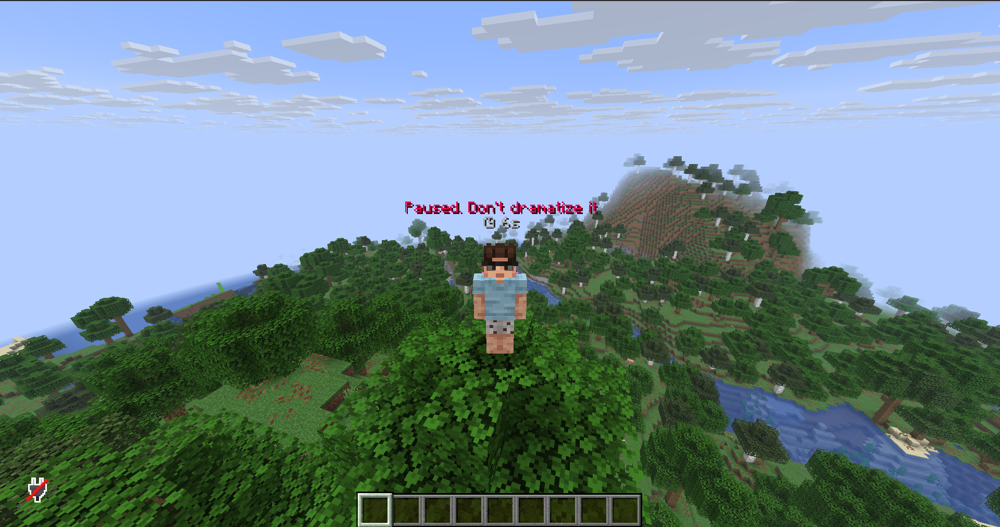

# OverHeadMessage

A lightweight **Leaf/Paper** plugin that duplicates a player's chat message **above their head** using a `TextDisplay` entity — with smooth appear/idle/disappear animations, per-group colors via **LuckPerms**, and a built-in **AFK** system exposed through **PlaceholderAPI**.

> Author: **ZiTr_** · Target: **Leaf/Paper 1.21.x** (Java 21) · Built with Maven

---

## ✨ Features

- 💬 **Overhead chat** — every chat message floats above the sender's head as a `TextDisplay` (not an ArmorStand).
- 🧍 **Rides the player** — the display is a passenger of the player, so it moves perfectly with them.
- 🎞️ **Clean animations**
  - **Appear:** smooth scale-up.
  - **Idle:** gentle, flicker-free bobbing.
  - **Disappear:** flies upward while shrinking, then is removed.
- 🔁 **Smart re-trigger** — a new message instantly plays the old one's disappear animation before showing the new one.
- 🎨 **Colors**
  - `&` legacy codes **and** inline `#RRGGBB` hex.
  - A leading `!` switches to a separate color (and the `!` is stripped, not shown).
  - **LuckPerms** group overrides (`group_priority` + `group_overrides`).
- 😴 **AFK system**
  - After a configurable idle time, a random phrase + a live timer (`30s → 1m → 1h 2m`) appear above the head.
  - Any movement / interaction / chat clears it instantly.
  - **PlaceholderAPI** placeholders so you can show an AFK tag anywhere (tab, scoreboard, nametag…).
- 🪶 **Featherweight** — ~0.1% of a server thread under profiling; no heavy loops, no entity leaks.
- 🛡️ **Version-tolerant** — optional visual APIs are guarded, so it won't crash on older/newer builds.

---

## 🖼️ Screenshots

**Overhead chat / AFK message**



**AFK tag in tab (via PlaceholderAPI)**


---

## 📦 Installation

1. Download / build `OverHeadMessage-1.0.0.jar` (see [Building](#-building)).
2. Drop it into your server's `plugins/` folder.
3. *(Optional)* Install **[LuckPerms](https://luckperms.net/download)** for per-group colors.
4. *(Optional)* Install **[PlaceholderAPI](https://www.spigotmc.org/resources/placeholderapi.6245/)** for the AFK placeholders.
5. Restart the server and edit `plugins/OverHeadMessage/config.yml`, then run `/ohm reload`.

---

## 🔨 Building

Requires **JDK 21** and **Maven**.

```bash
mvn clean package
```

The jar will be at `target/OverHeadMessage-1.0.0.jar`.

---

## ⚙️ Configuration

```yml
display-time-ticks: 120     # how long the message stays (20 ticks = 1s)
fade-in-ticks: 2            # appear animation length
idle-animation: true        # gentle bobbing
fade-out-ticks: 4          # disappear animation length
max-message-length: 80      # messages longer than this are truncated
y-offset: 0.35             # height above the head
scale: 0.9                 # text scale
text-shadow: true
enabled-worlds: []          # empty = all worlds
debug: false

colors:
  default: '#FFFFFF'         # normal message color
  with_exclamation: '#FF6B6B' # color when the message starts with '!'
  group_priority:            # LuckPerms groups, highest priority first
    - admin
    - moderator
  group_overrides:
    admin:
      default: '#FF5555'
      with_exclamation: '#FFAA00'
    moderator:
      default: '#55FFFF'
      with_exclamation: '#00FFAA'

afk:
  enabled: true
  idle-ticks: 600            # idle time before AFK (20 ticks = 1s)
  update-interval-ticks: 20  # timer refresh rate
  placeholder_text: '#888888 >> #D0BE9BAFK'  # exposed as %ohm_afk%
  timer_text_format: '&7⌚ %time%'
  messages:                  # one random line is picked
    - '%group_color%AFK. Breathe easy'
    # ... see config.yml for the full list
```

> `%group_color%` in AFK messages uses the group's **`with_exclamation`** color.

---

## 🧩 PlaceholderAPI

| Placeholder        | Returns                                            |
|--------------------|----------------------------------------------------|
| `%ohm_afk%`        | The colorized `placeholder_text` while AFK, else "" |
| `%ohm_afk_time%`   | Adaptive AFK time (e.g. `1h 2m`) while AFK, else "" |
| `%ohm_afk_state%`  | `true` / `false`                                   |

The plugin never writes to the tab itself — drop `%ohm_afk%` wherever you like.

---

## 🎮 Commands & Permissions

| Command        | Description              |
|----------------|--------------------------|
| `/ohm reload`  | Reload the config        |
| `/ohm status`  | Show current settings    |

| Permission              | Default |
|-------------------------|---------|
| `overheadmessage.admin` | op      |

---

## ✅ Compatibility

- **Server:** Leaf / Paper 1.21.x (uses stable Bukkit/Paper API; degrades gracefully on other versions).
- **Java:** 21+
- **Soft dependencies:** LuckPerms, PlaceholderAPI (both optional).

---

## 📄 License

Released under the [MIT License](LICENSE).
